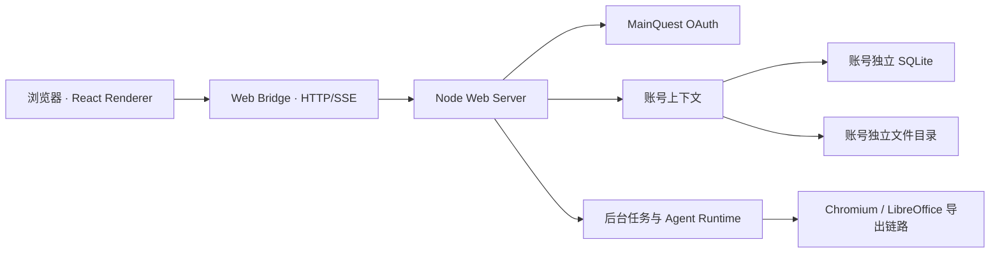

# Bidding Copilot Web · MainQuest v1 SDD 总控方案

## 1. 目标与完成边界

目标是在现有 Bidding Copilot 基础上交付可通过浏览器访问、可用 Docker 部署、接入 MainQuest OAuth、按账号隔离数据的 Web v1，同时移除资源下载、投标机会和插件管理。

本轮设计完成边界：

- 建立独立分支与集成 worktree。
- 冻结 Web v1 产品范围和关键技术假设。
- 形成 7 个有依赖顺序、可独立验收的 Sprint Spec。
- 定义每个 Sprint 的 SDD 模式、工包、所有权、验证和审查门。
- 不进入业务代码实现，不创建生产资源，不注册 OAuth 应用。

## 2. 当前事实

- Renderer 为 React 19 + TypeScript + Vite。
- Renderer 通过 `window.yibiao` 使用 Electron preload 提供的能力。
- Electron Main 承担配置、SQLite、文件解析、后台任务、AI、Agent、图片渲染和 Word 导出。
- 当前数据位于 Electron `userData`，默认只有一个本地用户工作区。
- 当前本地图片渲染依赖 Electron `BrowserWindow`。
- OpenCode 二进制与 `rg/fd/jq` 准备脚本缺少 `linux-x64`。
- `taskService.cjs` 已有 callback subscriber，可转换为 Web SSE。
- CSS 共约 13,624 行，保留页面仍有大量硬编码颜色，因此配色替换需要 Token 迁移加页面审计。
- gbrain 当前未注册 Bidding Copilot source。实施并行前需要先确认项目 policy；本轮不执行 sync。

## 3. 核心架构



### 3.1 最小迁移策略

- 保留 React 页面和 `window.yibiao` 调用模型。
- 在浏览器启动时注入 Web Bridge，用 HTTP/SSE 实现同一业务接口。
- 逐步把 Electron services 中可复用的业务逻辑抽到运行环境无关的 core。
- Electron preload 继续服务桌面启动，Web Bridge 服务浏览器启动。
- Web API 入口增加鉴权、上传限制、路径隔离和密钥保护；进程内部服务继续保持简洁调用。

### 3.2 v1 部署模型

- 一个 Node 服务进程。
- 一个持久卷。
- 一个全局身份与会话库。
- 每个本地账号记录映射到独立 workspace ID。
- 每个 workspace 使用独立 SQLite 和文件目录。
- SSE 承担后台任务进度推送。
- Chromium 承担 HTML/Mermaid 图片渲染。
- LibreOffice 承担现有链路需要的办公文档转换。

建议数据结构：

```text
/data
  /system
    auth.sqlite
  /users
    /<local-workspace-uuid>
      config.enc.json
      /workspace
        yibiao.sqlite
        /technical-plan
        /knowledge-base
        /generated-images
      /logs
```

## 4. 已锁定的范围规则

### 4.1 Web 与桌面共存

- Web v1 在现有仓库和现有客户端 package 内增量建设。
- Electron 现有构建在迁移期继续通过。
- 环境差异集中在启动入口、Bridge、文件交互、渲染和部署层。
- 业务 Store、Prompt、AI 与 Agent 逻辑优先复用。

### 4.2 前端视觉

- 仅采用 MQDS v4.1 Light 的颜色体系。
- 页面背景：`#ffffff`
- 次级背景：`#f3f4f6`
- 主文字：`#111827`
- 次文字：`#6b7280`
- 弱文字：`#9ca3af`
- 弱边框：`#e5e7eb`
- 主操作：`#111827`
- 成功状态：文字 `#166534`，背景 `#dcfce7`
- 警告与错误继续使用可访问的语义色。
- 现有尺寸、圆角、间距、字体、阴影结构和动画参数保持原值。

### 4.3 删除能力

- 应用侧完全移除资源下载、投标机会、插件管理。
- `analytics/` 独立服务保持原状。
- 保留功能的埋点与模型统计继续工作。
- `adm-zip` 若仍被文件解析或其他保留能力使用，继续保留依赖。

## 5. 七个 Sprint

| Sprint | 业务结果 | 前置 | 计划模式 |
| --- | --- | --- | --- |
| 01 | 产品面完成删减，建立干净基线 | 无 | SDD Light |
| 02 | 浏览器可启动，Web Bridge 和 API 骨架可用 | 01 | SDD Heavy |
| 03 | MainQuest 登录、会话、退出和接口保护完成 | 02 | SDD Heavy |
| 04 | 账号数据隔离与浏览器上传/下载链路完成 | 03 | SDD Heavy |
| 05 | 后台任务、Linux Agent、渲染和导出可用 | 04 | SDD Heavy |
| 06 | 保留页面完成 MQDS 浅色配色替换 | 05 | SDD Light |
| 07 | Docker 可部署并通过完整业务验收 | 06 | SDD Heavy |

每个 Sprint 都是一个完整 development batch。上一 Sprint 达到 `PASS` 后，下一 Sprint 才可创建开发工包。

## 6. Git 与 worktree 方案

### 6.1 集成面

- 长期集成分支：`feature/web-mainquest-v1`
- 长期集成 worktree：`/Users/dingcheng/Coding-Project/02-key-project/Bidding-Copilot-web-mainquest`
- 集成分支只接收已完成验证的 Sprint 提交。

### 6.2 子代理临时工作面

每个 Sprint 从当时的集成 HEAD 建立临时分支：

```text
sdd/web-mainquest-s01-pruning
sdd/web-mainquest-s02-web-runtime
sdd/web-mainquest-s03-oauth
...
```

临时 worktree 建议放在：

```text
/Users/dingcheng/Coding-Project/02-key-project/Bidding-Copilot-sdd-worktrees/web-mainquest-v1/
```

规则：

- 一个开发工包对应一个独立 worktree。
- 多工包只有在文件所有权无交叉时并行。
- 工包完成后必须提交并返回 commit SHA。
- 主线程按依赖顺序检查并集成。
- Sprint 通过后再清理临时 worktree；分支保留到整个 v1 验收完成。

## 7. SDD 运行协议

### 7.1 模型路由

| 角色 | 默认路由 | 权限 |
| --- | --- | --- |
| 实现 | `gpt-5.3-codex-spark`，high | 隔离 worktree 可写 |
| 实现容量回退 | `gpt-5.6-luna`，max | 仅在 Spark 明确容量失败后使用 |
| 风险审查 | `gpt-5.6-terra`，high | 只读 |
| 原则审查 | `gpt-5.6-sol`，medium | 只读 |
| 修复 | Spark high，容量失败后 Luna max | 集成修复 worktree 可写 |

首次真实 worker 启动时验证实际模型。模型路由证据和额度扣减证据分开记录。

### 7.2 Sprint 启动门

每个 Sprint 启动前，主线程必须完成：

1. 确认上一 Sprint 为 `PASS`。
2. 记录当前集成 commit SHA。
3. 确认集成 worktree 干净。
4. 确认 gbrain policy；未明确时不启动并行 worker。
5. 读取对应 Sprint Spec。
6. 给每个 worker 明确所有权、禁改范围和验证命令。
7. 创建临时分支与 worktree。

### 7.3 集成门

1. 检查 worker 返回的行为变化、文件、命令结果和 commit SHA。
2. 拒绝越权修改或缺少验证证据的提交。
3. 按依赖顺序集成。
4. 运行 Sprint 聚焦验证。
5. 冻结一个不可变 commit SHA 和验证记录。
6. 只对冻结提交启动审查。

### 7.4 审查门

- SDD Light：按主风险选择 Terra 或 Sol。
- SDD Heavy：Terra 与 Sol 并行审查同一冻结提交。
- 主线程合并重复问题、排除误报、确定阻断项。
- 修复 worker 只接收主线程整理后的单一修复清单。
- 修复后先由主线程验证；高风险阻断代码发生变化时，可做一次定向 Terra 复审。
- 产品行为、架构或关键假设发生实质变化时，再增加 Sol 复审。

### 7.5 终态

- `PASS`：所有阻断项关闭，要求的验证通过。
- `REVISE`：需要老板决定产品、架构或验收标准。
- `STOP`：存在当前授权和环境内无法解除的外部或安全阻断。

## 8. 全局验收标准

Web v1 只有同时满足以下条件才可交付：

1. Docker 启动后健康检查通过，刷新和容器重启后数据仍在。
2. MainQuest 登录、退出、会话过期和无权限访问行为清晰。
3. 两个测试账号之间无法读取对方配置、文件、任务和业务数据。
4. 浏览器完成招标文件导入、知识库、查重、废标检查和技术方案主流程。
5. 后台任务可推送进度，页面刷新后能恢复可解释状态。
6. Linux 环境至少有一个 Agent Runtime 稳定完成核心生成任务。
7. Word 导出、Mermaid/HTML 图片渲染和下载通过。
8. 三个删除能力没有菜单、路由、页面和应用侧服务入口。
9. 保留页面只发生配色变化，组件、布局与交互无结构变化。
10. 浏览器、接口响应和普通日志中不出现 API Key、OAuth secret 或用户文档正文。
11. Electron 构建保持通过，除非后续由老板单独决定停止桌面版。

## 9. 关键假设与决策门

| 决策 | 当前默认 | 最晚确认时间 |
| --- | --- | --- |
| 账号数据模型 | 每账号独立 SQLite 与目录 | Sprint 03 启动前 |
| Web 授权模型 | MainQuest 产品访问权限 | Sprint 03 启动前 |
| 模型密钥 | 用户自带，服务端加密保存 | Sprint 04 启动前 |
| 部署拓扑 | 单实例 + 持久卷 | Sprint 02 启动前 |
| 正式域名和 OAuth 回调 | 环境变量注入 | Sprint 07 启动前 |
| gbrain policy | 待确认，建议长期重点项目使用 read-write | 首个并行 worker 前 |

## 10. 全局非目标

- 深色模式和主题切换。
- 组件库替换、页面重构、响应式布局重做。
- 多实例横向扩容、共享数据库和对象存储。
- 组织、团队、角色和后台管理系统。
- 生产环境发布、域名购买、OAuth 应用注册和真实密钥写入。
- 清理 `analytics/` 的资源或插件后台接口。
- 与 Web v1 无直接关系的历史代码整理。
